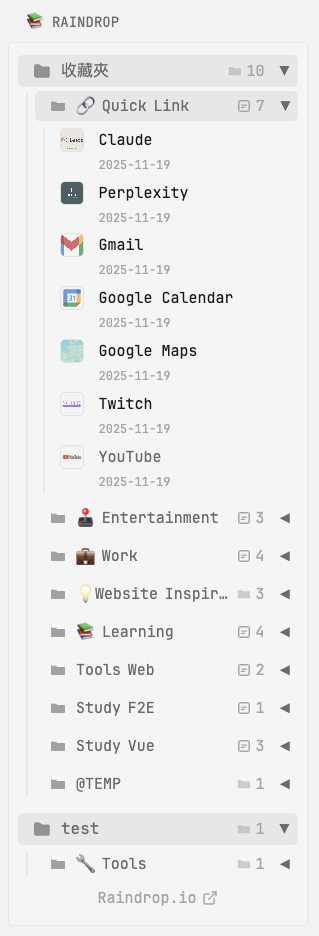

# Raindrop Bookmarks Widget

A comprehensive Raindrop.io bookmarks widget that displays your groups, collections, sub-collections, and bookmarks with full three-level hierarchy support.



## Features

-   📁 **Three-Level Hierarchy**: Display groups, collections, and sub-collections with proper ordering
-   🗂️ **Custom Sorting**: Respects your Raindrop.io group organization and collection order
-   🔖 **Bookmark Details**: Shows cover images, titles, tags, and creation dates
-   🎨 **Collection Colors**: Visual color indicators for each collection
-   🔄 **Auto-refresh**: 24-hour cache with manual refresh support
-   ⚠️ **Smart Limitations**: Displays the 50 most recent bookmarks (API limitation)
-   ✨ **Auto-expand Options**: Configure which groups and collections open by default
-   🔗 **Quick Access**: Click widget title to open Raindrop.io
-   🔐 **Token Error Handling**: Automatic redirect to settings page when token expires

## Configuration

```yaml
- type: custom-api
  title: 📚 Raindrop
  title-url: https://app.raindrop.io/
  url: https://api.raindrop.io/rest/v1/collections
  headers:
      Authorization: Bearer ${RAINDROP_TOKEN}
  cache: 1d
  template: |
      {{/* Configuration options */}}
      {{ $autoOpenFirstGroup := true }}  {{/* Auto-open first group */}}
      {{ $autoOpenFirstCollection := true }}  {{/* Auto-open first collection in opened group */}}
      {{ $showCover := true }}  {{/* Show cover images for bookmarks */}}

      {{/* Fetch user data for groups */}}
      {{ $userReq := newRequest "https://api.raindrop.io/rest/v1/user"
          | withHeader "Authorization" "Bearer ${RAINDROP_TOKEN}"
          | getResponse
      }}

      {{/* Fetch child collections */}}
      {{ $childrensReq := newRequest "https://api.raindrop.io/rest/v1/collections/childrens"
          | withHeader "Authorization" "Bearer ${RAINDROP_TOKEN}"
          | getResponse
      }}

      {{/* Fetch recent raindrops (latest 50) */}}
      {{ $raindropsReq := newRequest "https://api.raindrop.io/rest/v1/raindrops/0"
          | withParameter "perpage" "50"
          | withHeader "Authorization" "Bearer ${RAINDROP_TOKEN}"
          | getResponse
      }}

      {{/* Check if all API calls succeeded */}}
      {{ if and (eq .Response.StatusCode 200) (eq $userReq.Response.StatusCode 200) (eq $childrensReq.Response.StatusCode 200) (eq $raindropsReq.Response.StatusCode 200) }}
        {{ $allCollections := .JSON.Array "items" }}
        {{ $userGroups := $userReq.JSON.Array "user.groups" }}
        {{ $childCollections := $childrensReq.JSON.Array "items" }}
        {{ $allRaindrops := $raindropsReq.JSON.Array "items" }}

        <style>
          /* Corner link hover effect */
          .corner-link-raindrop-bookmarks {
            transition: color 0.3s;
          }
          .corner-link-raindrop-bookmarks:hover {
            color: var(--color-text-highlight);
          }

          /* Enable container queries for responsive grid */
          .container-raindrop-bookmarks {
            container-type: inline-size;
          }

          /* Fix summary arrow line-height */
          .container-raindrop-bookmarks .summary::after {
            line-height: 25px;
          }

          /*
           * Arrow rotation strategy for nested details (3 levels)
           *
           * IMPORTANT: This uses a two-step override approach to neutralize Glance's
           * global styles that may interfere with our custom rotation logic.
           *
           * Step 1: Reset all nested summaries to 0deg (right-pointing arrow)
           *         This overrides any global Glance styles
           * Step 2: Apply -90deg to direct children (down-pointing arrow when open)
           *         This creates the actual rotation for each level
           *
           * Result: Each details level independently controls its own arrow rotation
           */

          /* Step 1: Override Glance global styles - reset all nested summaries */
          .container-raindrop-bookmarks details[open] .summary::after {
            rotate: 0deg;
          }

          /* Step 2: Apply rotation to direct child summary only */
          .container-raindrop-bookmarks details[open] > .summary::after {
            rotate: -90deg;
          }

          /* Show background when details is open */
          .container-raindrop-bookmarks details[open] > .summary::before {
            opacity: 1;
          }

          /* Responsive grid for bookmarks using container queries */
          .grid-raindrop-bookmarks {
            display: grid;
            gap: 1.5rem;
            grid-template-columns: repeat(3, 1fr);
          }
          @container (max-width: 900px) {
            .grid-raindrop-bookmarks { grid-template-columns: repeat(2, 1fr); }
          }
          @container (max-width: 640px) {
            .grid-raindrop-bookmarks {
              grid-template-columns: 1fr;
            }

            /* 調整書籤內的圖片和佔位符大小 */
            .grid-raindrop-bookmarks img.thumbnail,
            .grid-raindrop-bookmarks .shrink-0 {
              width: 24px !important;
              height: 24px !important;
            }

            /* 調整時間和 tag 字級為 font-size-h5 */
            .grid-raindrop-bookmarks .list-horizontal-text .size-h3 {
              font-size: var(--font-size-h5);
            }
          }
        </style>

        {{/* Main groups list */}}
        <div class="container-raindrop-bookmarks">
          <ul class="list list-gap-20">
            {{/* Iterate through user groups */}}
            {{ range $groupIndex, $group := $userGroups }}
            {{ $groupTitle := .String "title" }}
            {{ $groupHidden := .Bool "hidden" }}
            {{ $groupCollectionIds := .Array "collections" }}

            {{/* Skip hidden groups */}}
            {{ if not $groupHidden }}

            {{/* Count collections in this group */}}
            {{ $groupCollectionCount := len $groupCollectionIds }}

            <li>
              {{/* Group level (Layer 1) */}}
              <details {{ if $autoOpenFirstGroup }}open{{ end }}>
                <summary class="summary flex justify-between items-center rounded select-none" style="padding: 0 2rem 0 0.75rem;">
                  <div class="flex items-center gap-10 min-width-0 flex-1">
                    {{/* Group icon */}}
                    <svg width="18" height="18" viewBox="0 0 16 16" fill="none" style="flex-shrink: 0;">
                      <path d="M1 3.5C1 2.67157 1.67157 2 2.5 2H5.17157C5.70201 2 6.21071 2.21071 6.58579 2.58579L7.41421 3.41421C7.78929 3.78929 8.29799 4 8.82843 4H13.5C14.3284 4 15 4.67157 15 5.5V12.5C15 13.3284 14.3284 14 13.5 14H2.5C1.67157 14 1 13.3284 1 12.5V3.5Z" fill="currentColor" opacity="0.7"/>
                    </svg>
                    <span class="size-h2 text-truncate">{{ $groupTitle }}</span>
                  </div>
                  <div class="flex items-center gap-5 size-h3 color-subdue" style="margin-right: 0.5rem;">
                    <svg width="14" height="14" viewBox="0 0 16 16" fill="none">
                      <path d="M1.75 3C1.33579 3 1 3.33579 1 3.75V12.25C1 12.6642 1.33579 13 1.75 13H14.25C14.6642 13 15 12.6642 15 12.25V5.75C15 5.33579 14.6642 5 14.25 5H7.82843C7.56321 5 7.30886 4.89464 7.12132 4.70711L6.37868 3.96447C6.19114 3.77693 5.93679 3.67157 5.67157 3.67157L1.75 3.67157C1.33579 3.67157 1 3.33579 1 2.92157V3.75C1 3.33579 1.33579 3 1.75 3Z" fill="currentColor" opacity="0.5"/>
                    </svg>
                    <span>{{ $groupCollectionCount }}</span>
                  </div>
                </summary>

                {{/* Group content - collections in this group */}}
                <div style="padding-left: 1.5rem; margin-top: 1rem; border-left: 2px solid var(--color-separator);">
                  <ul class="list list-gap-14">
                    {{/* Iterate through collections in this group */}}
                    {{ range $collIndex, $collId := $groupCollectionIds }}
                      {{/* Extract ID from GJSON result by removing braces */}}
                      {{ $collIdStr := printf "%v" $collId }}
                      {{ $collIdStr = trimPrefix "{" $collIdStr }}
                      {{ $collIdStr = trimSuffix "}" $collIdStr }}

                      {{/* Find the collection in $allCollections */}}
                      {{ range $allCollections }}
                        {{ if eq (printf "%v" (.Int "_id")) $collIdStr }}
                          {{ $collectionId := .Int "_id" }}
                          {{ $collectionTitle := .String "title" }}
                          {{ $collectionColor := .String "color" }}

                          {{/* Count child collections */}}
                          {{ $childrenCount := 0 }}
                          {{ range $childCollections }}
                            {{ if eq (.Int "parent.$id") $collectionId }}
                              {{ $childrenCount = add $childrenCount 1 }}
                            {{ end }}
                          {{ end }}

                          {{/* Count items in this collection */}}
                          {{ $itemsCount := 0 }}
                          {{ range $allRaindrops }}
                            {{ if eq (.Int "collection.$id") $collectionId }}
                              {{ $itemsCount = add $itemsCount 1 }}
                            {{ end }}
                          {{ end }}

                          <li>
                            {{/* Collection level (Layer 2) */}}
                            <details {{ if and $autoOpenFirstCollection (eq $groupIndex 0) (eq $collIndex 0) }}open{{ end }}>
                              <summary class="summary flex justify-between items-center rounded select-none" style="padding: 0 2rem 0 0.75rem;">
                                <div class="flex items-center gap-10 min-width-0 flex-1">
                                  {{/* Folder icon */}}
                                  <svg width="16" height="16" viewBox="0 0 16 16" fill="none" style="flex-shrink: 0;">
                                    <path d="M1.75 3C1.33579 3 1 3.33579 1 3.75V12.25C1 12.6642 1.33579 13 1.75 13H14.25C14.6642 13 15 12.6642 15 12.25V5.75C15 5.33579 14.6642 5 14.25 5H7.82843C7.56321 5 7.30886 4.89464 7.12132 4.70711L6.37868 3.96447C6.19114 3.77693 5.93679 3.67157 5.67157 3.67157L1.75 3.67157C1.33579 3.67157 1 3.33579 1 2.92157V3.75C1 3.33579 1.33579 3 1.75 3Z" fill="currentColor" opacity="0.6"/>
                                  </svg>
                                  {{/* Color indicator */}}
                                  {{ if $collectionColor }}
                                    <span class="rounded" style="width: 10px; height: 10px; background-color: {{ $collectionColor }}; flex-shrink: 0; display: inline-block;"></span>
                                  {{ end }}
                                  <span class="size-h3 text-truncate">{{ $collectionTitle }}</span>
                                </div>
                                <div class="flex items-center gap-10 size-h3 color-subdue" style="margin-right: 0.5rem;">
                                  {{ if gt $childrenCount 0 }}
                                    <div class="flex items-center gap-5">
                                      <svg width="14" height="14" viewBox="0 0 16 16" fill="none">
                                        <path d="M1.75 3C1.33579 3 1 3.33579 1 3.75V12.25C1 12.6642 1.33579 13 1.75 13H14.25C14.6642 13 15 12.6642 15 12.25V5.75C15 5.33579 14.6642 5 14.25 5H7.82843C7.56321 5 7.30886 4.89464 7.12132 4.70711L6.37868 3.96447C6.19114 3.77693 5.93679 3.67157 5.67157 3.67157L1.75 3.67157C1.33579 3.67157 1 3.33579 1 2.92157V3.75C1 3.33579 1.33579 3 1.75 3Z" fill="currentColor" opacity="0.5"/>
                                      </svg>
                                      <span>{{ $childrenCount }}</span>
                                    </div>
                                  {{ end }}
                                  {{ if gt $itemsCount 0 }}
                                    <div class="flex items-center gap-5">
                                      <svg width="14" height="14" viewBox="0 0 16 16" fill="none">
                                        <path d="M2 3.5C2 2.67157 2.67157 2 3.5 2H12.5C13.3284 2 14 2.67157 14 3.5V12.5C14 13.3284 13.3284 14 12.5 14H3.5C2.67157 14 2 13.3284 2 12.5V3.5Z" stroke="currentColor" stroke-width="1.5" fill="none"/>
                                        <path d="M5 7H11M5 9.5H9" stroke="currentColor" stroke-width="1.5" stroke-linecap="round"/>
                                      </svg>
                                      <span>{{ $itemsCount }}</span>
                                    </div>
                                  {{ end }}
                                </div>
                              </summary>

                              {{/* Collection content */}}
                              <div style="padding-left: 1.5rem; margin-top: 1rem; border-left: 2px solid var(--color-separator);">
                                {{/* Display sub-collections (Layer 3) */}}
                                {{ if gt $childrenCount 0 }}
                                  <div style="margin-bottom: 1.5rem;">
                                    <ul class="list list-gap-14">
                                      {{ range $childCollections }}
                                        {{ if eq (.Int "parent.$id") $collectionId }}
                                          {{ $childId := .Int "_id" }}
                                          {{ $childTitle := .String "title" }}
                                          {{ $childColor := .String "color" }}

                                          {{/* Count items in sub-collection */}}
                                          {{ $childItemsCount := 0 }}
                                          {{ range $allRaindrops }}
                                            {{ if eq (.Int "collection.$id") $childId }}
                                              {{ $childItemsCount = add $childItemsCount 1 }}
                                            {{ end }}
                                          {{ end }}

                                          <li>
                                            <details>
                                              <summary class="summary flex justify-between items-center rounded select-none" style="padding: 0 2rem 0 0.5rem;">
                                                <div class="flex items-center gap-10 min-width-0 flex-1">
                                                  {{/* Folder icon */}}
                                                  <svg width="14" height="14" viewBox="0 0 16 16" fill="none" style="flex-shrink: 0;">
                                                    <path d="M1.75 3C1.33579 3 1 3.33579 1 3.75V12.25C1 12.6642 1.33579 13 1.75 13H14.25C14.6642 13 15 12.6642 15 12.25V5.75C15 5.33579 14.6642 5 14.25 5H7.82843C7.56321 5 7.30886 4.89464 7.12132 4.70711L6.37868 3.96447C6.19114 3.77693 5.93679 3.67157 5.67157 3.67157L1.75 3.67157C1.33579 3.67157 1 3.33579 1 2.92157V3.75C1 3.33579 1.33579 3 1.75 3Z" fill="currentColor" opacity="0.5"/>
                                                  </svg>
                                                  {{ if $childColor }}
                                                    <span class="rounded" style="width: 8px; height: 8px; background-color: {{ $childColor }}; flex-shrink: 0; display: inline-block;"></span>
                                                  {{ end }}
                                                  <span class="size-h3 text-truncate">{{ $childTitle }}</span>
                                                </div>
                                                {{ if gt $childItemsCount 0 }}
                                                  <div class="flex items-center gap-5 size-h3 color-subdue" style="margin-right: 0.5rem;">
                                                    <svg width="12" height="12" viewBox="0 0 16 16" fill="none">
                                                      <path d="M2 3.5C2 2.67157 2.67157 2 3.5 2H12.5C13.3284 2 14 2.67157 14 3.5V12.5C14 13.3284 13.3284 14 12.5 14H3.5C2.67157 14 2 13.3284 2 12.5V3.5Z" stroke="currentColor" stroke-width="1.5" fill="none"/>
                                                      <path d="M5 7H11M5 9.5H9" stroke="currentColor" stroke-width="1.5" stroke-linecap="round"/>
                                                    </svg>
                                                    <span>{{ $childItemsCount }}</span>
                                                  </div>
                                                {{ end }}
                                              </summary>

                                              {{/* Sub-collection raindrops */}}
                                              <div style="padding-left: 1.5rem; margin-top: 0.75rem;">
                                                {{ if gt $childItemsCount 0 }}
                                                  <div class="grid-raindrop-bookmarks">
                                                    {{ range $allRaindrops }}
                                                      {{ if eq (.Int "collection.$id") $childId }}
                                                        <div style="min-width: 0;">
                                                          <a href="{{ .String "link" }}" target="_blank" rel="noreferrer" class="flex gap-15 items-start color-primary-if-not-visited" style="text-decoration: none;">
                                                            {{/* Cover image or placeholder */}}
                                                            {{ if .String "cover" }}
                                                              
                                                            {{ else }}
                                                              <div class="shrink-0 flex items-center justify-center rounded" style="width: 48px; height: 48px; background: var(--color-widget-background); border: 1px solid var(--color-separator);">
                                                                <span class="size-h3 color-subdue">#</span>
                                                              </div>
                                                            {{ end }}

                                                            {{/* Raindrop details */}}
                                                            <div class="flex-column min-width-0 flex-1">
                                                              <div class="size-h3 text-truncate margin-bottom-3">{{ .String "title" }}</div>

                                                              <ul class="list-horizontal-text">
                                                                <li>
                                                                  <span class="size-h3 color-subdue">{{ .String "created" | parseTime "RFC3339" | formatTime "DateOnly" }}</span>
                                                                </li>
                                                                {{ $tags := .Array "tags" }}
                                                                {{ range $tags }}
                                                                  {{ $tagStr := printf "%v" . }}
                                                                  {{ $tagStr = trimPrefix "{" $tagStr }}
                                                                  {{ $tagStr = trimSuffix "}" $tagStr }}
                                                                  <li>
                                                                    <span class="size-h3 color-subdue">#{{ $tagStr }}</span>
                                                                  </li>
                                                                {{ end }}
                                                              </ul>
                                                            </div>
                                                          </a>
                                                        </div>
                                                      {{ end }}
                                                    {{ end }}
                                                  </div>
                                                {{ else }}
                                                  <div class="color-subdue size-h3" style="padding: 0.5rem; font-style: italic;">
                                                    No bookmarks in this sub-collection or not in recent 50
                                                  </div>
                                                {{ end }}
                                              </div>
                                            </details>
                                          </li>
                                        {{ end }}
                                      {{ end }}
                                    </ul>
                                  </div>
                                {{ end }}

                                {{/* Raindrops for this collection (not in sub-collections) */}}
                                {{ if gt $itemsCount 0 }}
                                  <div class="grid-raindrop-bookmarks">
                                    {{ range $allRaindrops }}
                                      {{ if eq (.Int "collection.$id") $collectionId }}
                                        <div style="min-width: 0;">
                                          <a href="{{ .String "link" }}" target="_blank" rel="noreferrer" class="flex gap-15 items-start color-primary-if-not-visited" style="text-decoration: none;">
                                            {{/* Cover image or placeholder */}}
                                            {{ if .String "cover" }}
                                              
                                            {{ else }}
                                              <div class="shrink-0 flex items-center justify-center rounded" style="width: 48px; height: 48px; background: var(--color-widget-background); border: 1px solid var(--color-separator);">
                                                <span class="size-h3 color-subdue">#</span>
                                              </div>
                                            {{ end }}

                                            {{/* Raindrop details */}}
                                            <div class="flex-column min-width-0 flex-1">
                                              <div class="size-h3 text-truncate margin-bottom-3">{{ .String "title" }}</div>

                                              <ul class="list-horizontal-text">
                                                <li>
                                                  <span class="size-h3 color-subdue">{{ .String "created" | parseTime "RFC3339" | formatTime "DateOnly" }}</span>
                                                </li>
                                                {{ $tags := .Array "tags" }}
                                                {{ range $tags }}
                                                  {{ $tagStr := printf "%v" . }}
                                                  {{ $tagStr = trimPrefix "{" $tagStr }}
                                                  {{ $tagStr = trimSuffix "}" $tagStr }}
                                                  <li>
                                                    <span class="size-h3 color-subdue">#{{ $tagStr }}</span>
                                                  </li>
                                                {{ end }}
                                              </ul>
                                            </div>
                                          </a>
                                        </div>
                                      {{ end }}
                                    {{ end }}
                                  </div>
                                {{ else if eq $childrenCount 0 }}
                                  <div class="color-subdue size-h3" style="padding: 0.5rem; font-style: italic;">
                                    No bookmarks in this collection or not in recent 50
                                  </div>
                                {{ end }}
                              </div>
                            </details>
                          </li>
                        {{ end }}
                      {{ end }}
                    {{ end }}
                  </ul>
                </div>
              </details>
            </li>
            {{ end }}
          {{ end }}
        </ul>
        </div>

        {{/* Bottom Link */}}
        <div class="flex justify-center margin-top-10">
          <a href="https://app.raindrop.io/" target="_blank" class="corner-link-raindrop-bookmarks size-h3 color-subdue flex items-center gap-5">
            <span>Raindrop.io</span>
            <svg xmlns="http://www.w3.org/2000/svg" width="16" height="16" viewBox="0 0 24 24" fill="none" stroke="currentColor" stroke-width="2" stroke-linecap="round" stroke-linejoin="round"><path d="M18 13v6a2 2 0 0 1-2 2H5a2 2 0 0 1-2-2V8a2 2 0 0 1 2-2h6"></path><polyline points="15 3 21 3 21 9"></polyline><line x1="10" y1="14" x2="21" y2="3"></line></svg>
          </a>
        </div>

      {{ else }}
        {{/* Error handling */}}
        <div style="padding: 1.5rem; background: var(--color-widget-background); border-radius: 0.5rem;">
          <h4 class="size-h3 color-negative" style="margin-bottom: 0.75rem;">⚠️ Failed to Load Data</h4>
          <div class="color-subdue size-h3">
            <p style="margin-bottom: 0.75rem;">Please check the following:</p>
            <ul class="list list-gap-4" style="padding-left: 1.5rem;">
              <li>Environment variable <code>RAINDROP_TOKEN</code> is correctly set</li>
              <li>Token is valid and not expired
                {{ if or (eq .Response.StatusCode 401) (eq $userReq.Response.StatusCode 401) (eq $childrensReq.Response.StatusCode 401) (eq $raindropsReq.Response.StatusCode 401) }}
                  <br><a href="https://app.raindrop.io/settings/integrations" target="_blank" rel="noreferrer" class="color-primary" style="margin-top: 0.5rem; display: inline-block;">→ Go to Raindrop settings page to get a new Token</a>
                {{ end }}
              </li>
              <li>Network connection is working properly</li>
            </ul>
            <div style="margin-top: 1.5rem;">
              <strong>API Response Status:</strong>
              <ul class="list list-gap-4" style="padding-left: 1.5rem; margin-top: 0.5rem;">
                <li>Collections: {{ .Response.StatusCode }} - {{ .Response.Status }}</li>
                <li>User Data: {{ $userReq.Response.StatusCode }} - {{ $userReq.Response.Status }}</li>
                <li>Child Collections: {{ $childrensReq.Response.StatusCode }} - {{ $childrensReq.Response.Status }}</li>
                <li>Raindrops: {{ $raindropsReq.Response.StatusCode }} - {{ $raindropsReq.Response.Status }}</li>
              </ul>
            </div>
          </div>
        </div>
      {{ end }}
```

## Environment Variables

### Required

-   `RAINDROP_TOKEN`: Your Raindrop.io API token

### How to Get Your Token

1. Visit [Raindrop.io Settings - Integrations](https://app.raindrop.io/settings/integrations)
2. Click "Create new app" or use an existing one
3. Generate a test token
4. Copy the token and set it as an environment variable:

```bash
export RAINDROP_TOKEN="your_token_here"
```

Or add it to your Glance configuration environment file.

## Customization

### Configuration Options

The template includes several configuration variables at the top:

```yaml
{{ $autoOpenFirstGroup := true }}        # Auto-open all groups by default
{{ $autoOpenFirstCollection := true }}   # Auto-open first collection in each group
{{ $showCover := true }}                 # Show cover images for bookmarks
```

- **`$autoOpenFirstGroup`**: Set to `true` to expand all groups automatically, `false` to keep them collapsed
- **`$autoOpenFirstCollection`**: Set to `true` to expand the first collection in the first group, `false` to keep all collections collapsed
- **`$showCover`**: Set to `true` to display cover images for bookmarks, `false` to hide them and show only text

### Responsive Grid Layout

The widget automatically adjusts the number of columns based on the container width using container queries:

- **> 900px**: 3 columns
- **640px - 900px**: 2 columns
- **< 640px**: 1 column (mobile) with optimized compact layout:
  - Cover images reduced to 24px × 24px
  - Date and tag text size reduced to `--font-size-h5`

### Cache Duration

Default cache is 24 hours (`1d`). You can adjust this:

```yaml
cache: 12h  # 12 hours
cache: 30m  # 30 minutes
cache: 1w   # 1 week
```

### Widget Title

You can customize the widget title:

```yaml
title: 🔖 My Bookmarks
title: 📚 Reading List
```

## API Usage & Structure

### Three-Level Hierarchy

The widget uses multiple Raindrop API endpoints to build a complete hierarchy:

1. **Groups** (Layer 1): Fetched from `/user` endpoint - Your custom organizational groups
2. **Collections** (Layer 2): Fetched from `/collections` endpoint - Sorted by group membership
3. **Sub-collections** (Layer 3): Fetched from `/collections/childrens` endpoint - Nested under collections
4. **Bookmarks**: Fetched from `/raindrops/0` endpoint - The 50 most recent items

### API Limitations

-   The widget displays the **50 most recent bookmarks** due to Raindrop API's per-page limit
-   Collections are ordered according to your Raindrop.io group settings
-   Hidden groups are automatically filtered out

## Troubleshooting

### Token Expired

If your token expires (HTTP 401), the widget will automatically display a link to generate a new token at [Raindrop Settings](https://app.raindrop.io/settings/integrations).

### No Bookmarks Showing

-   Ensure you have bookmarks in your Raindrop account
-   Check that the `RAINDROP_TOKEN` environment variable is correctly set
-   Verify your token has not expired

### Groups or Collections Not Expanding

-   Make sure you're clicking on the group/collection name or folder icon
-   Some collections may be empty or have no bookmarks in the recent 50 items
-   Check the `$autoOpenFirstGroup` and `$autoOpenFirstCollection` configuration options

### Collections Not Showing in Groups

-   Ensure your collections are assigned to groups in Raindrop.io
-   Hidden groups won't be displayed (check group settings in Raindrop.io)

## Credits

-   Uses [Raindrop.io API](https://developer.raindrop.io)
-   Designed for [Glance](https://github.com/glanceapp/glance)

## License

This widget configuration is provided as-is for use with Glance.

